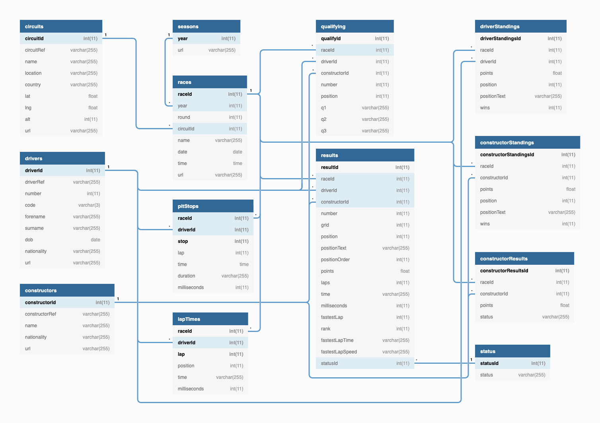

# Formula 1 Analytics Lakehouse

A production-ready analytics workspace for Formula 1 data, built on Azure Data Lake Storage Gen2, Azure Databricks, and Azure Data Factory. The notebooks in this repository ingest raw Ergast datasets, curate Delta tables, compute driver and constructor standings, and surface insights through reusable analysis notebooks.

---

## 1. Architecture at a Glance

| Layer | Azure Service | Description |
|-------|---------------|-------------|
| Ingestion & Compute | **Azure Databricks** (runtime 16.4, `Standard_D4ds_v5` single-node cluster) | Executes all notebooks, hosts Delta Lake runtime, manages secrets through scoped configs. |
| Storage | **Azure Data Lake Storage Gen2** (`formulaonedatalk`) | Zonal layout: `/raw`, `/processed`, `/presentation` exposed to Databricks via mounts or ABFS paths. |
| Orchestration | **Azure Data Factory** | Triggers Databricks Jobs (JSON under `jobs/`) on a schedule, parameterising `p_file_date`. |
| Secrets | **Azure Key Vault** + Databricks secret scope (`formula1-scope`) | Stores storage keys, SAS tokens, and service-principal credentials used by setup notebooks. |
| Metadata | **Delta Lake** | Backing format for processed and presentation tables, enabling ACID merges and incremental refreshes. |



> The diagram above (checked into the repo root) illustrates the Ergest logical model; the notebooks implement the blue-highlighted pipelines.

---

## 2. Repo Structure & Notebook Catalogue

```
Formula1-databricks-project/
├── analysis/                # Exploratory notebooks & visual exports
├── demo/                    # Training notebooks covering Spark SQL features
├── includes/                # Shared configuration & helper functions
├── ingestion/               # Domain-specific ingestion pipelines (+ orchestrator)
├── jobs/                    # Databricks Job definitions for ADF / CI pipelines
├── raw/                     # SQL DDL registering raw ADLS files as external tables
├── setup/                   # Authentication & mount walkthroughs
├── transformations/         # Presentation-layer builds & standing computations
├── utils/                   # Helpers for incremental load demos
├── visualization_charts/    # HTML exports generated from analysis notebooks
└── delta_data/, incremental_load_data/  # Runtime Delta outputs (excluded from docs)
```

### Notebook Matrix

| Notebook | Purpose | Key Inputs | Outputs |
|----------|---------|------------|---------|
| `ingestion/0. ingest_all_files.ipynb` | Orchestrates ingestion notebooks with `dbutils.notebook.run` | Widgets: `p_data_source`, `p_file_date` | Sequential runs of notebooks 1–8; exits "Success" or raises error |
| `ingestion/1. ingest_circuits.ipynb` | Loads `/raw/<file_date>/circuits.csv` with typed schema | ADLS mount + widgets | Delta table `f1_processed.circuits` |
| `ingestion/2. ingest_races.ipynb` | Adds `race_timestamp` and metadata columns | Same | `f1_processed.races` (partitioned by `race_year`) |
| `ingestion/3. ingest_constructors.ipynb` | Cleans constructor JSON | - | `f1_processed.constructors` |
| `ingestion/4. ingest_drivers.ipynb` | Flattens driver names and metadata | - | `f1_processed.drivers` |
| `ingestion/5. ingest_results.ipynb` | Upserts race results via Delta merge | - | `f1_processed.results` |
| `ingestion/6-8` | Pit stops, lap times, qualifying ingestion | - | Respective Delta tables |
| `transformations/1. race_results.ipynb` | Joins processed tables into a presentation fact | `file_date` widget | `f1_presentation.race_results` |
| `transformations/2-3` | Calculate driver & constructor standings | Derived from presentation fact | `f1_presentation.driver_standings`, `f1_presentation.constructor_standings` |
| `transformations/5` | Example of calculated points table | `f1_processed.*` | `f1_presentation.calculated_race_results` |
| `setup/*.ipynb` | Configure access (keys, SAS, SPN, cluster-scoped) | Secret scope `formula1-scope` | Spark config updates, mounts, verification reads |
| `analysis/*.ipynb` | Dominant drivers/teams queries, visualisations | Presentation tables | HTML charts & on-screen insights |

---

## 3. Data Contracts & Schemas

### Raw Zone (`f1_raw`, external tables)

| Table | Source | Columns |
|-------|--------|---------|
| `circuits` | `/raw/circuits.csv` | `circuitId INT`, `circuitRef STRING`, `name STRING`, `location STRING`, `country STRING`, `lat DOUBLE`, `lng DOUBLE`, `alt INT`, `url STRING` |
| `races` | `/raw/races.csv` | `raceId INT`, `year INT`, `round INT`, `circuitId INT`, `name STRING`, `date DATE`, `time STRING`, `url STRING` |
| `constructors` | `/raw/constructors.json` | `constructorId INT`, `constructorRef STRING`, `name STRING`, `nationality STRING`, `url STRING` |
| `drivers` | `/raw/drivers.json` | `driverId INT`, `driverRef STRING`, `number INT`, `code STRING`, `name STRUCT<forename: STRING, surname: STRING>`, `dob DATE`, `nationality STRING`, `url STRING` |
| `results` | `/raw/results.json` | `resultId INT`, `raceId INT`, `driverId INT`, `constructorId INT`, `number INT`, `grid INT`, `position INT`, `positionText STRING`, `positionOrder INT`, `points FLOAT`, `laps INT`, `time STRING`, `milliseconds INT`, `fastestLap INT`, `rank INT`, `fastestLapTime STRING`, `fastestLapSpeed FLOAT`, `statusId STRING` |
| `pit_stops` | `/raw/pit_stops.json` | `raceId INT`, `driverId INT`, `stop STRING`, `lap INT`, `time STRING`, `duration STRING`, `milliseconds INT` |
| `lap_times` | `/raw/lap_times/` | `raceId INT`, `driverId INT`, `lap INT`, `position INT`, `time STRING`, `milliseconds INT` |
| `qualifying` | `/raw/qualifying/` | `qualifyId INT`, `raceId INT`, `driverId INT`, `constructorId INT`, `number INT`, `position INT`, `q1 STRING`, `q2 STRING`, `q3 STRING` |

### Processed Zone (`f1_processed`, Delta)

All processed tables share metadata columns: `data_source STRING`, `file_date STRING`, `ingestion_date TIMESTAMP`. Highlights:

- **`circuits`** – Adds aliases (`circuit_id`, `circuit_ref`, `latitude`, `longitude`, `altitude`).
- **`races`** – Derives `race_timestamp` from `date` + `time`, partitions by `race_year`.
- **`results`** – Drop duplicates on (`race_id`, `driver_id`), uses dynamic Delta merge to support incremental loads.
- **`lap_times` & `pit_stops`** – Deduplicated on composite keys (race, driver, lap/stop).

### Presentation Zone (`f1_presentation`, Delta)

| Table | Description | Columns |
|-------|-------------|---------|
| `race_results` | Enriched fact table joining drivers, constructors, circuits | `race_id`, `race_year`, `race_name`, `race_date`, `circuit_location`, `driver_name`, `driver_number`, `driver_nationality`, `team`, `grid`, `fastest_lap`, `race_time`, `points`, `position`, `file_date`, `created_date` |
| `driver_standings` | Windowed aggregation of driver performance | `race_year`, `driver_name`, `driver_nationality`, `total_points`, `wins`, `rank`, metadata |
| `constructor_standings` | Constructor standings by year | `race_year`, `team`, `total_points`, `wins`, `rank`, metadata |
| `calculated_race_results` | Example alt scoring system | `race_year`, `team_name`, `driver_name`, `position`, `points`, `calculated_points` |

---

## 4. Prerequisites & Secrets

1. **Azure Resources**
   - Databricks workspace with Premium/Enterprise tier (for secret scopes & ADF integration).
   - ADLS Gen2 account `formulaonedatalk` with containers: `raw`, `processed`, `presentation`.
   - Azure Key Vault with secrets surfaced to Databricks scope `formula1-scope`.
   - Azure Data Factory (optional for orchestration).

2. **Secret Scope Entries** (`formula1-scope`)
   - `formula1dl-account-key`
   - `formula1-demo-sas-token`
   - `formula1-app-client-id`, `formula1-app-tenant-id`, `formula1-client-secret` (service-principal auth)
   - `formula1dl-client-id`, `formula1dl-tenant-id`, `formula1dl-client-secret` (mount credentials)

3. **Cluster Configuration**
   - Example recorded in `clusters/Stefan Tiberiu Paduraru's Cluster.txt` (`Standard_D4ds_v5`, auto-terminate 60 minutes).
   - Adjust cluster size for production workloads (e.g., job cluster with autoscaling).

---

## 5. Runbook

### Initial Deployment

1. Clone this repo into Databricks workspace (`Repos > Add Repo` or git clone locally).
2. Execute the appropriate `setup/` notebook to establish storage connectivity:
   - `1.access_adls_using_access_keys` for account-key auth (development only).
   - `2.access_adls_using_sas_keys` for limited-lived access.
   - `3.access_adls_using_service_principal` (recommended for production).
   - `7.mount_adls_using_service_principal` to mount `/mnt/formulaonedatalk/<zone>`.
3. Optional: Run `raw/create_raw_tables.ipynb` to expose raw files in SQL as `f1_raw.*` tables.
4. Execute `ingestion/0. ingest_all_files.ipynb` with defaults to prime the processed layer.
5. Execute `transformations/1. race_results.ipynb` followed by `2` and `3` to populate presentation tables.
6. Open `analysis/` notebooks or HTML charts to verify results.

### Scheduled Operation

1. Import `jobs/ingest_all_files_job.txt` into Databricks Jobs UI (or via REST API).
2. Configure Azure Data Factory to call the job and supply `p_file_date` for new data drops.
3. Optional: chain additional tasks for transformation notebooks or add QA steps.
4. Monitor job runs via Databricks UI; failures propagate to ADF for alerting.

### Incremental Refresh Demo

1. Run `utils/1. prepare_for_incremental_load.ipynb` to drop/recreate curated schemas.
2. Re-run desired ingestion notebook(s) with a new `p_file_date` to merge incremental files.
3. Execute transformation notebooks to refresh presentation aggregates.
